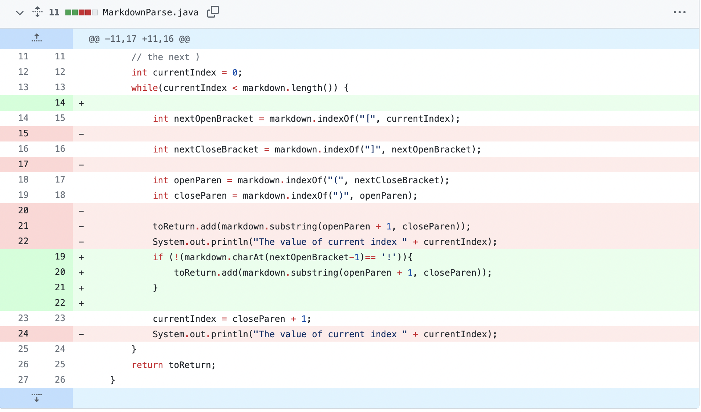
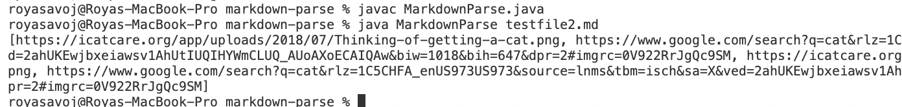
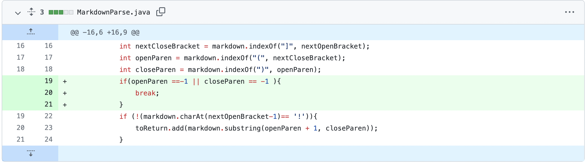
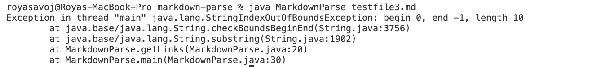
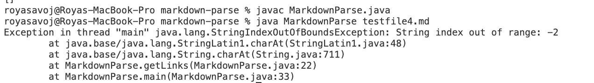

# Lab 2: 
## Code Change 1: Image in markdown
 Images should not be included in the markdownParse() list of links
 
 1. Github Code Change 
 
 
 2. Link to the failure inducing test file 
 
 [File that caused image Error](https://rsavoj.github.io/cse15l-lab-reports/Lab-report-2/testfile2.html)
 
 3. Symptom of failure:  Images should not be included in the markdownParse() list of links
 

 4. Relationship between the bug and the symptom: The markdownParse() code identifies links using brackets and parenthesis. Images also use brackets and parenthesis for formating in markdown. If we use the original markdownParse() code it will read the image as a link. The symptom of this bug is that the image is included in the list of links. To fix this bug we added a line of code checking if the image had a ! before it. If this was the case then the code would skip over the image and not add it to the list of links.

## Code Change 2: Only Brackets 
 
 1. Github Code Change 
 

 2. Link to failure including test file 

[File that caused image Error](https://rsavoj.github.io/cse15l-lab-reports/Lab-report-2/testfile3.html)

 3. Symptom of failure:  The input () caused an index out of bounds error.
  

 4. Relationship between the bug and the symptom: The symptom was caused because there was a bug in the code. When there where no [] after (). The code would try to perform the substring operation using the index 0 and index -1: `markdown.substring(0,-1)`. You cannot create a substring starting at 0 and ending at -1. This line produces the symptom of an `IndexOutOfBoundsError`. To fix this we made sure the line was not called unless the index of `openParen` and `closedParen` where greater than 0.

## Code Change 3: Extra Spaces
 
 1. Github Code Change 
 

 2. Link to failure including test file 

[File that caused image Error](https://rsavoj.github.io/cse15l-lab-reports/Lab-report-2/testfile4.html)

 3. Symptom of failure:  The input () caused an index out of bounds error.
  

 4. Relationship between the bug and the symptom: The code calls `charAt(nextOpenBraket-1)`. This produces a bug because nextOpenBracket can be negative. Calling `charAt(negative)` produces the symptom of an index out of bounds error. To fix this code we can add an if statment to check the value of nextOpenBraket and nextClosedBracket.
 
