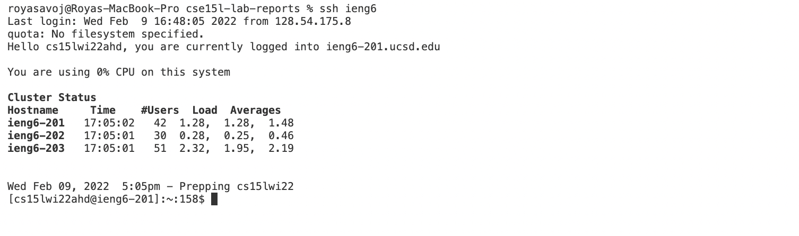
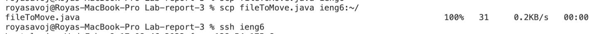
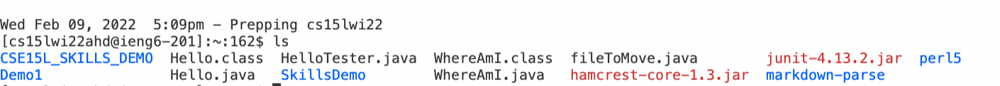

# Lab 3: Streamlining ssh Configuration
## ssh/config file

I created the config file by entering the \.ssh file on my local directory. I created the file and used the vim command to edit it. I coppied and pasted the code from Lab report 5. Then changed the email to the correct course specific email.

## scp command 

