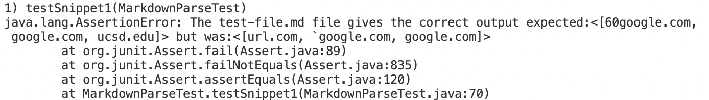
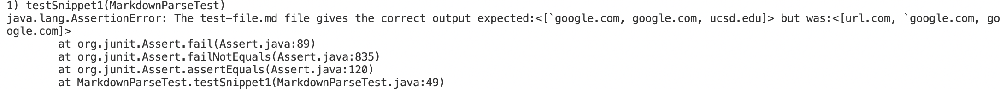
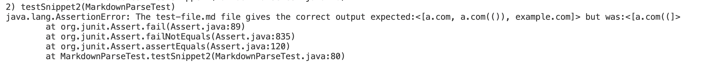
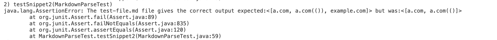
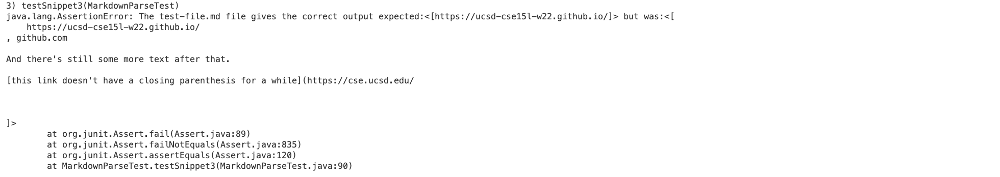

# Testing Snippet 1,2,3
## Important Links 
[Index of site](https://rsavoj.github.io/cse15l-lab-reports/)

[My Marrkdown.parse Repository](https://github.com/rsavoj/markdown-parse)

[Reviewed Markdown.parse Repository](https://github.com/ExtraExaByte/MarkDownParse)
## Snippet 1
[Snippet 1 file](https://rsavoj.github.io/cse15l-lab-reports/Lab-report-4/Snippet1.md)

Expected Output for getLinks():
``[60google.com, google.com,ucsd.edu] ``

JUnit Test My version of MarkdownParse output:

JUnit Test Reviewed MarkdownParse output:

## Snippet 2
[Snippet 2 file](https://rsavoj.github.io/cse15l-lab-reports/Lab-report-4/Snippet2.md)

Expected  Output for getLinks():
`[a.com, a.com(()), example.com] `

JUnit Test My version of MarkdownParse output:

JUnit Test Reviewed MarkdownParse output:

## Snippet 3
[Snippet 3 file](https://rsavoj.github.io/cse15l-lab-reports/Lab-report-4/Snippet3.md)
Expected  Output for getLinks():
`[https://ucsd-cse15l-w22.github.io/] `

JUnit Test My version of MarkdownParse output:

JUnit Test Reviewed MarkdownParse output:

