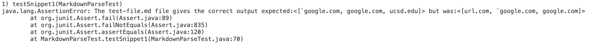

# Testing Snippet 1,2,3
## Important Links 
[Index of site](https://rsavoj.github.io/cse15l-lab-reports/)

[My MarkdownParse Repository](https://github.com/rsavoj/markdown-parse)

[Reviewed MarkdownParse Repository](https://github.com/ExtraExaByte/MarkDownParse)
## Snippet 1
[Snippet 1 file](https://rsavoj.github.io/cse15l-lab-reports/Lab-report-4/Snippet1.md)

Expected Output for getLinks():
``[60google.com, google.com,ucsd.edu] ``

JUnit Test used on both versions of MarkdownParse

JUnit Test My version of MarkdownParse output:

JUnit Test Reviewed version of MarkdownParse output:

**Code fix:** I think there is a code fix that is less than 10 lines. MarkdownParse could skip over code that is between two backticks or between one backtick and the next line by setting the `currentIndex` to the index after the second parenthesis or the next line's starting index and using `continue` to iterate through the loop, unless the backticks are within a links `()` or `[]`.
## Snippet 2
[Snippet 2 file](https://rsavoj.github.io/cse15l-lab-reports/Lab-report-4/Snippet2.md)

Expected  Output for getLinks():
`[a.com, a.com(()), example.com] `

JUnit Test used on both versions of MarkdownParse

JUnit Test My version of MarkdownParse output:

JUnit Test Reviewed version of MarkdownParse output:

**Code Fix:** I think there is a code fix that is less than 10 lines. Mardown parse could ignore inner parenthesis by counting the number of `(`, `)`, `[`, `]`. The code would then only look at the outer set of `()` or `[]` and treat all the brackets and parenthesis within the brackets as plain text. We could count all the parenthesis or brackets after an open or closed bracket or parenthesis till the next `(`/`[` wirh a matching set. Then use the outermost set of `()` or `[]` to get the links.
## Snippet 3
[Snippet 3 file](https://rsavoj.github.io/cse15l-lab-reports/Lab-report-4/Snippet3.md)

Expected  Output for getLinks():
`[https://ucsd-cse15l-w22.github.io/] `

JUnit Test used on both versions of MarkdownParse

JUnit Test My version of MarkdownParse output:

JUnit Test Reviewed version of MarkdownParse output:

