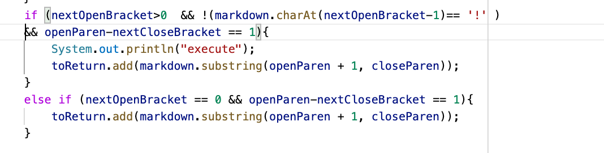
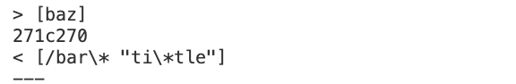

# Lab Report 5 common-mark-spec tests 
[Index of site](https://rsavoj.github.io/cse15l-lab-reports/)
## Test One 
**Difference in Test Results** 
I stored that data from running the bash script in a files named `resutls.txt` running the command `bash script.sh >results.txt` in each directory with a MarkdownParse.java file. I found the difference in test results in the `results.txt` files using the command `diff markdown-parseRoyas/results.txt markdown-parse/results.txt`

Test Results for Case 495: 

[file 495.md](https://rsavoj.github.io/cse15l-lab-reports/Lab-report-5/495.md)

**Expected Output**: `[(foo(and(bar))]`

**Correct Implementation** The correct implementation is the professors `markdownParse.java` file. The `))` should be included in the link.

**Cause of Bug** The code in my implementation of `markdownParse.java` tracks the end of the link by searching for the next `)`. If there is another parenthesis after a  `)`, the code between the parenthesis will not be included in the output of `getLinks()`

**Code to Fix**
 
Before we add the link to the array returned by `getLinks()` we need 
to check if there is an outer set of parenthesis

## Test Two
**Difference in Test Results** I stored that data from running the bash script in a files named `resutls.txt` running the command `bash script.sh > results.txt` in each directory with a MarkdownParse.java file. I found the difference in test results in the `results.txt` files using the command `diff markdown-parseRoyas/results.txt markdown-parse/results.txt`
,

Test Results for Case 523: 

[file 523.md](https://rsavoj.github.io/cse15l-lab-reports/Lab-report-5/523.md)

**Expected Output**:`[]`

**Correct Implementation** Neither of the implemenetations are correct because they do not produce the expected output.

**Cause of Bug** The cause of the bug is the `""`. The code should not be read as a link becasue the `]` ,`(` and `)` encasing what would be a link are inside `""`.
**Code to Fix**

We should ignore any code that is formated as a link `""` because it will not be read as a link by the markdown program. In order to fix this we could add an `if` statment to check if code needed for the proper link format(`(`, `)`, `[` or `]`) is contained in `""`.