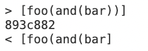

# Lab Report 5 common-mark-spec tests 
[Index of site](https://rsavoj.github.io/cse15l-lab-reports/)
## Test One 
**Difference in Test Results** 
I stored that data from running the bash script in a files named `resutls.txt` running the command `bash script.sh >results.txt` in each directory with a MarkdownParse.java file. I found the difference in test results in the `results.txt` files using the command `diff markdown-parseRoyas/results.txt markdown-parse/results.txt`

Test Results for Case 495: 

[file 495](https://rsavoj.github.io/cse15l-lab-reports/Lab-report-5/495.md)

**Expected Output**: `[(foo(and(bar))]`

**Correct Implementation** The correct implementation is the professors `markdownParse.java` file. The remaining closed parenthesis before the brackets should be included in the file

**Cause of Bug** The code in my implementation of markdown parse tracks the link by searching for the next closed braket. If there is another bracket after the center brackets will not be included in the link.
## Test Two
**Difference in Test Results** I stored that data from running the bash script in a files named `resutls.txt` running the command `bash script.sh >results.txt` in each directory with a MarkdownParse.java file. I found the difference in test results in the `results.txt` files using the command `diff markdown-parseRoyas/results.txt markdown-parse/results.txt`
,

Test Results for Case 495: 

[file 495](https://rsavoj.github.io/cse15l-lab-reports/Lab-report-5/523.md)

**Expected Output**:`[]`

**Correct Implementation** Neither of the implemenetations are correct because they do not produce the expected output.

**Cause of Bug** The cause of the bug is the `""`. The code should not be read as a link becasue the `]` ,`(` and `)` encasing what would be a link are inside `""`.