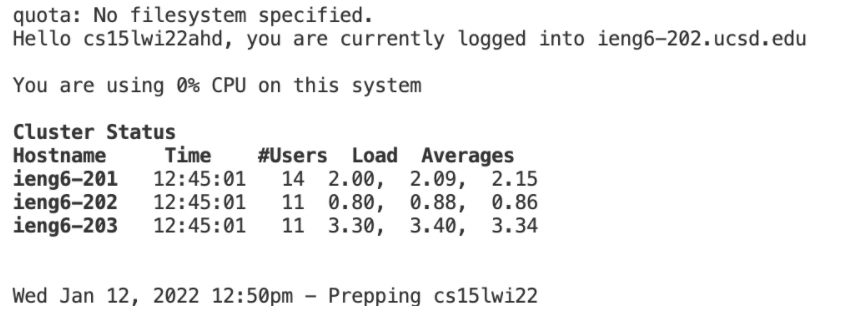
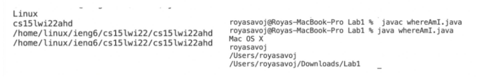

# Tutorial on how to log into your course specific account ieng6 c for ucsd CSE15L students!
## Installing VScode
1. Download visual Studio Code from [https://code.visualstudio.com/](https://code.visualstudio.com/)

2. The application interface should resemble the one below 

## Remotely Connecting

1.  I went to [https://sdacs.ucsd.edu/~icc/index.php](https://sdacs.ucsd.edu/~icc/index.php) to access my course specific account. To activate the account I changed the password and waited ~15 minutes.
2. To Open a new terminal in VS code I used + ` or opening a new terminal from the menu 

3. I entered ssh cs15lwi22ahd@ieng6.ucsd.edu, my course specific account. A password was prompted. I Entered in the one I made when my account was activated. When I logged in there terminal should looked like the one below.
 
 **Example Input** $ `ssh cs15lwi22ahd@ieng6.ucsd.edu`

## Trying Some Commands
Some of the commands I ran on the server: 
1. `cd~` 

2. `ls -a`

3. `ls -lat `

* along with additional commands  such as `cd`,
`ls`, `/home/linux/ieng6/cs15lwi22/cs15lwi22abc`, `cp /home/linux/ieng6/cs15lwi22/public/hello.txt`, `~/cat /home/linux/ieng6/cs15lwi22/public/hello.txt`

 To Leave the server I typed exit into the command line.

## Moving Files with scp

1. I  used the command scp fileName cs15lwi22ahd@ieng6.ucsd.edu:~/ to add a file to my home directory on the server.
 
 **Example Input** `scp WhereAmI.java cs15lwi22ahd@ieng.ucsd.edu:~/`

2. I Logged into my ssh account and use the command ls to check that the file was uploaded. The file was uploaded I tested its function using the java and javac commands.
 
 Example outputs of the function whereAmI.java on the clients computer vs. the servers computer.
 

 
 
 
 ## Setting an SSH Key

 1. I created a key to avoid using a passcode every time I logged into my ieng6 account. The ssh-keygen command creates a public key stored on the server and a private key stored on the client. I used the command ssh-keygen to generate a key. 

 **Example Input** `ssh-keygen`

2. I copyed the public key to the account directory on the server by loging into my ieng6 account and entering the command  mkdir .ssh.

 **Example Input** `mkdir .ssh`

3. image of logging in without a passcode using a key

4. This process minimizes the time it takes to change and run the file WhereAmI.java on the server.

> **Without Key**: Timer: 128 seconds, Keystrokes: 114

> **With Key** Timer: 63 seconds, Keystrokes 96

## Optimizing Remote Running
1. There are many ways to simplify the commands used for running programms on servers.
2. The command ssh cs15lwi22zz@ieng6.ucsd.edu "command". Will log into the direcory run the command in quotations and exit the directory. This command optimizes remote runnig by combing three lines of code into 1. 
 
 For the example in the image above 
 > **Without ""**: Timer: 13 seconds, Keystrokes: 43

> **With ""** Timer: 9 seconds, Keystrokes 41

 3. Semicolons can be used to run multiple commands at once. If quotations are placed around the command it will run both commands together.
 
  For the example in the image above 
 > **Without ;**: Timer: 20 seconds, Keystrokes: 98

> **With ;** Timer: 15 seconds, Keystrokes 68
 4. Use the command `scp my-file1.txt my-file2.txt cs15lwi22zz@ieng6.ucsd.edu:~/`, can be used to copy two files to the directory at once.
 > **Without 2 files**: Timer: 19 seconds, Keystrokes: 96

> **With 2 files** Timer: 17 seconds, Keystrokes 61

