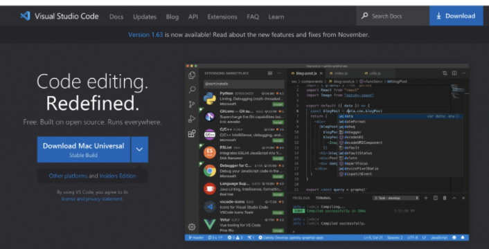
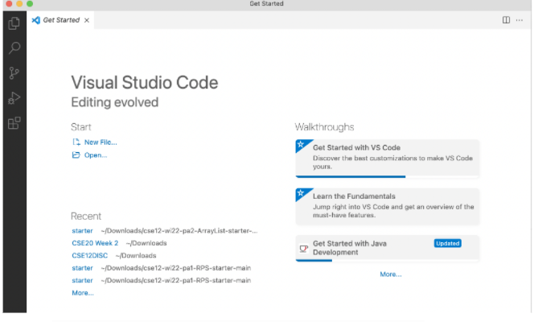
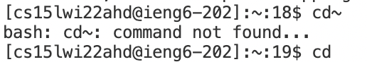
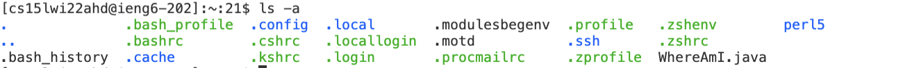
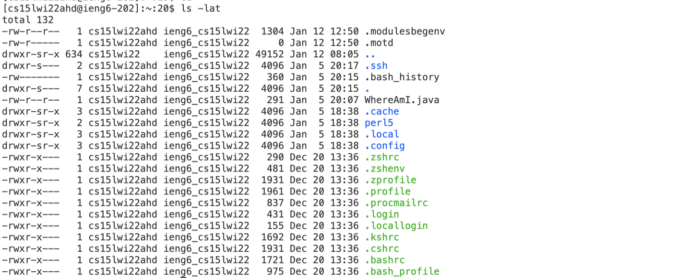
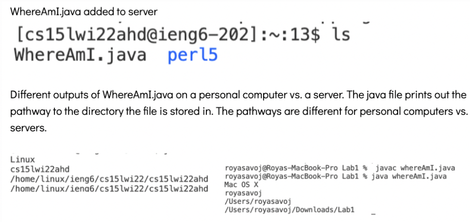
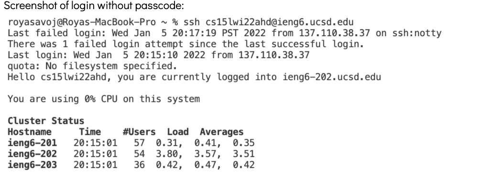
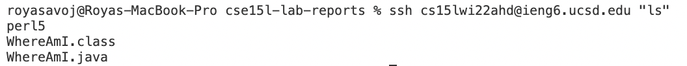
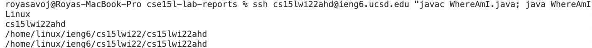

# Tutorial on how to log into your course specific account ieng6 c for ucsd CSE15L students!
## Installing VScode
1. Download visual Studio Code from [https://code.visualstudio.com/](https://code.visualstudio.com/)

2. The application interface should resemble the one below 

## Remotely Connecting

1. Go to [https://sdacs.ucsd.edu/~icc/index.php](https://sdacs.ucsd.edu/~icc/index.php) to access course specific account. To activate the account change the password and wait ~15 minutes.
2. Open a new terminal in VS code using + ` or opening a new terminal from the menu 

3. Enter ssh cs15lwi22zz@ieng6.ucsd.edu replacing the zz with your course specific ID. A password will be prompted. Enter in the one made when the account was activated. When logged in ther terminal should look like the one below.

> **Example Input** $ ssh cs15lwi22ahd@ieng6.ucsd.edu

## Trying Some Commands
 Run Some Commands 
1. cd~ 

2. ls -a

3. ls -lat 

* along with additional commands  such as cd,
ls /home/linux/ieng6/cs15lwi22/cs15lwi22abc, cp /home/linux/ieng6/cs15lwi22/public/hello.txt, ~/cat /home/linux/ieng6/cs15lwi22/public/hello.txt

 Leave the server by typing exit into the command line or pushing Ctrl-d

## Moving Files with scp

1. You can use the command scp "fileName" cs15lwi22zz@ieng6.ucsd.edu:~/ To add a file to your home directory on the server. Note you will be asked for a password if you have not implemented a key.
 
> **Example Input** WhereAmI.java cs15lwi22ahd@ieng.ucsd.edu:~/

2. Log into ssh account and use the command ls to check that the file was uploaded. If it was uploaded you can use java and javac commands.
 

 ## Setting an SSH Key
 1. One can create a key to avoid using a passcode every time they log into the ieng6 account. The ssh-keygen command creates a public key stored on the server and a private key stored on the client. Use the command ssh-keygen to generate a key. 
> **Example Input** ssh-keygen
2. Copy the public key to the account directory on the server by loging into the ieng6 account and entering the command  mkdir .ssh.
> **Example Input** mkdir .ssh

3. image of logging in without a passcode using a key

## Optimizing Remote Running
1. There are many ways to simplify the commands used for running programms on servers.
2. The command ssh cs15lwi22zz@ieng6.ucsd.edu "command". Will log into the direcory run the command in quotations and exit the directory. This command optimizes remote runnig by combing three lines of code into 1. 
 
 3. Semicolons can be used to run multiple commands at once. If quotations are placed around the command it will run both commands together.
 
 4. Use the command scp my-file1.txt my-file2.txt cs15lwi22zz@ieng6.ucsd.edu:~/, can be used to copy two files to the directory at once.

